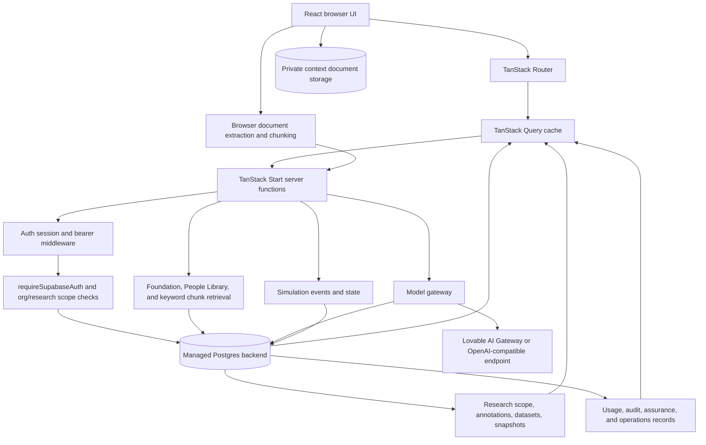

# Classroom Coach — Current Architecture

## System shape

Classroom Coach is a TanStack Start v1 application with React 19, TypeScript, TanStack Router, TanStack Query, and Vite. Protected application routes call typed TanStack Start server functions. Those functions use the generated managed-backend client, enforce authentication and organization/research scope, read/write a Postgres data model, and call a centralized model gateway for generation, rehearsal turns, and review synthesis.

The Cloudflare-compatible server entry is `src/server.ts`. It imports the generated TanStack Start server entry, normalizes swallowed SSR errors, and returns a rendered error page on catastrophic failures. The Vite integration is configured in `vite.config.ts` through `@lovable.dev/vite-tanstack-config`.

## Data flow

## Frontend

### Route and layout structure

- `src/routes/__root.tsx` is the root document shell. It installs the stylesheet, fonts, default metadata, `QueryClientProvider`, error boundary, and not-found UI. It renders `<Outlet />`.
- `src/routes/_authenticated/route.tsx` is a pathless protected layout. Its `beforeLoad` checks the current user and redirects unauthenticated visitors to `/auth`; it renders `<Outlet />`.
- `src/routes/index.tsx` is the public landing route.
- `src/routes/auth.tsx` is the client-only sign-in/sign-up route.
- Authenticated screens are `library.tsx`, `design.index.tsx`, `design.$id.tsx`, `rehearse.index.tsx`, `rehearse.$id.tsx`, `review.index.tsx`, `review.$sessionId.tsx`, `research.index.tsx`, `research.$projectId.tsx`, and `research.$projectId.session.$sessionId.tsx`. Route behavior is documented in `PRODUCT_OVERVIEW.md`.
- `src/routeTree.gen.ts` is generated and must not be edited.

All feature routes currently use `useServerFn` plus TanStack Query (`useQuery`/`useMutation`). No route audited uses a TanStack Router data loader; authentication is the route-level `beforeLoad` gate and feature data is client-fetched after mount.

### Shared UI

`src/components/AppShell.tsx` is the de facto application shell and primitive layer. It contains role-aware navigation, environment banner, sign-out, footer, accessibility skip-link, and shared class-string primitives such as `btn`, `btnPrimary`, `input`, `Chip`, `Section`, `Drawer`, `DetailList`, and source chips.

- `FoundationPanel.tsx` displays active foundation resources in Design Lab.
- `AssurancePanel.tsx` combines assurance checks, flagged-moment reruns, model configuration controls, and the admin-only operations panel in the Research workspace.
- `OperationsPanel.tsx` displays system health, model reliability/usage, and audit data.
- `ai-elements/message.tsx` supplies the transcript message components used by Rehearse. It also contains unused message actions/branch/response helpers.
- `ai-elements/conversation.tsx` defines conversation helpers but has no current application imports.
- `src/components/ui/*` contains a broad shadcn-style component scaffold. Feature routes primarily use AppShell class strings instead of those primitives.

### State and caching

- Server state is held in a single `QueryClient` created by `src/router.tsx` and provided in `__root.tsx`.
- Query keys are manually selected per feature, for example `scenario`, `people`, `sessions`, `published`, `research`, and project/session-specific keys.
- Mutations are mixed: some use `useMutation`, while many use local async handlers, busy flags, error strings, and manual `refetch`/`invalidateQueries`.
- Design scenario editing uses a local `spec` object and a hand-rolled one-second debounce before `saveDraftSpec` (`design.$id.tsx:79-95`).
- Authentication state is separate from the query cache and is maintained by `useAuth.ts`, which subscribes to `getSession()` and `onAuthStateChange`.
- No Redux, Zustand, Jotai, or other global client state store is present.

## Authentication and authorization

- `src/integrations/supabase/client.ts` is the generated browser client. It reads publishable client configuration from environment variables and uses preview-aware session storage.
- `previewAuthStorage.ts` brokers auth storage between preview contexts with origin validation and falls back to local storage outside preview.
- `src/integrations/supabase/auth-attacher.ts` adds the current bearer token to TanStack Start function calls. It is registered in `src/start.ts`.
- `src/integrations/supabase/auth-middleware.ts` defines `requireSupabaseAuth`, which validates the bearer token and injects `userId`, claims, and an authenticated client into server-function context. The API functions compose this middleware.
- `src/lib/server/orgContext.server.ts` resolves the caller profile, user roles, organization memberships, and organization role. `requireAuthoring`, `requireAdmin`, and `requireOrgMember` provide early server-side authorization checks.
- Backend RLS policies remain the enforcement floor. Roles are in `user_roles` and `organization_memberships`, not on profiles and not in browser storage.
- `src/start.ts` also installs CSRF protection for server functions and an error middleware. `src/server.ts` converts severe server errors into a consistent HTML error response.
- `src/integrations/supabase/client.server.ts` contains the privileged service client. It is server-only and must remain dynamically imported from server-side code paths.

## Backend/API layer

App-internal API boundaries are `createServerFn` modules under `src/lib/api/`. They are client-importable wrappers whose handlers execute server-side. The main modules are:

- `admin.functions.ts`: caller identity, display name, model configuration activation, flagged moment reruns, assurance checks, and flagged-event listing.
- `assignments.functions.ts`: group listing/creation and assignment listing/creation/closing.
- `documents.functions.ts`: context document lifecycle and storage metadata.
- `generate.functions.ts`: structured scenario derivation with validation and audit.
- `operations.functions.ts`: system health, audit events, and usage summaries.
- `rehearsal.functions.ts`: session start/load, turn submission, scene changes, ending, flags, session listing, and published scenario listing.
- `research.functions.ts`: research workspaces, scoped session inspection, annotations, dataset preview/save/export, snapshots, export history, collection settings, and project creation.
- `review.functions.ts`: event-log-based review synthesis plus session feedback.
- `scenarios.functions.ts`: scenario CRUD/archive, draft updates, publish/version creation, People Library, and foundation reads.

Server functions use Zod validation at the input/schema boundaries where applicable. Database write failures are returned as plain-language errors or thrown through the common error path; exact response conventions vary by function.

## Database model

The generated database contract is `src/integrations/supabase/types.ts`. It currently describes 32 public tables, two RPC functions, and the `app_role` enum.

### Core accounts, organizations, and authorization

- `profiles`: user id, email, display name, created timestamp.
- `user_roles`: user id, role, unique user/role pair.
- `organizations`: organization identity, slug, retention settings, usage limit settings.
- `organization_memberships`: organization/user membership, role, owner/status fields.
- `courses_or_groups`: organization group/course name, owner, archive state.
- `group_memberships`: group/user membership and role/status.
- `group_invitations`: group/email invitation, role, expiry, acceptance fields.

### Scenario authoring and context

- `scenarios`: owner, title/subtitle, practice purpose, practicing role, setting, specifics, status, draft spec, generation error, model metadata, archive/sample fields.
- `context_documents`: scenario/owner, file metadata, storage path, processing status/error, extracted character count.
- `document_chunks`: document/scenario/owner, chunk index, source name, content, character count.
- `foundation_resources`: active governing resources, body, version, sort order.
- `foundation_versions`: versioned foundation resource JSON and notes; the current application reads `foundation_resources` instead.
- `people_profiles`: reusable People Library profiles with participant type, grade, background, tendencies, relationships, interests, known and hidden information.
- `scenario_versions`: immutable published snapshot metadata, JSON spec, foundation/model/context references, creator metadata.
- `scenario_participants`: participant snapshot for a scenario version, including known/latent information and provenance.

### Rehearsal and governance

- `rehearsal_sessions`: owner, scenario/version/assignment links, timestamps, review JSON, foundation version, state sequence, release.
- `simulation_states`: one current JSON state and sequence per session.
- `simulation_events`: ordered event log with kind, user action, visible response, prior/resulting state, state update, model metadata, status, latency, and release.
- `flags`: event/session flag reason, note, status, and user.
- `after_action_reviews`: persisted structured synthesis, event count, model metadata, owner/organization.
- `session_feedback`: instructor/owner feedback body and author/session/organization links.
- `assurance_runs`: structured assurance checks associated with an event.
- `audit_events`: actor, action, object/version, organization, metadata, and timestamp.
- `model_configurations`: provider/model/endpoints, generation settings, turn-model override, timeouts/retries/concurrency, cost fields, credential reference, configuration version, active state.
- `model_usage_events`: function type, provider/model/configuration, token counts, latency, cost estimate, attempt/repair/success/error information, and related IDs.

### Research

- `research_projects`: organization-owned research workspace and collection settings.
- `research_scopes`: project/user scope grants for organization, project, group, scenario, or assignment access.
- `research_participants`: project-local pseudonym mapping for user ids.
- `research_datasets`: named dataset definitions.
- `research_snapshots`: versioned dataset payload, definition, field schema, version information, and row count.
- `research_annotations`: project/session/event annotation body and author.

### RPCs and database-side atomicity

- `commit_simulation_event` is the current commit path. It validates session ownership/actor, sequence expectations, event kind, and writes the event/state transactionally. Rehearsal code calls it through the privileged server client (`rehearsal.functions.ts:302-304`, `:384-388`).
- `commit_simulation_turn` remains in the generated contract and database migrations but is not called by current application code; it is legacy/dead implementation surface.
- The `app_role` enum is `admin | educator | learner`.

## AI/model calls

### Central gateway

`src/lib/ai/gateway.server.ts` is the intended single consequential model-call boundary. `runModelCall` handles:

- active configuration and per-call metadata;
- in-process concurrency gates keyed by configuration id;
- bounded retries with exponential backoff;
- one structured-output repair prompt after validation failure;
- token/cost estimation and a `model_usage_events` insert per attempt;
- provider/error classification and plain-language failure return;
- turn-model override when `functionType === "turn"`.

`src/lib/ai/modelAdapter.server.ts` implements two provider paths: a Responses API/SSE path for `openai/*` models and a Chat Completions path for other models, with SSE handling for `google/gemini-*` and a priority service tier. An OpenAI-compatible endpoint can read a server-side credential reference. The gateway URL is hardcoded to the managed AI gateway.

The fallback config in `modelAdapter.server.ts:30-38` uses `openai/gpt-5.6-sol`; the active database configuration and deployment environment should be confirmed before relying on that fallback.

### Prompt/context assembly

- `prompts.server.ts` defines generation, turn, and review system/user prompt construction.
- Generation includes foundation text, People Library profiles, retrieved document chunks, and user inputs; output must satisfy `ScenarioSpecSchema` and include provenance.
- Turn prompts include a compact foundation, closed published cast, current JSON state, and approximately the last eight turns. The prompt instructs the model to move the room, gate latent information by relevance, support scene changes, and produce a closing beat.
- Review prompts synthesize the persisted event evidence and return a short summary plus bounded sections. They do not re-run the interaction.

## Document processing and storage

The browser performs extraction in `src/lib/documents/extractText.ts`:

- `.docx` uses the browser Mammoth build;
- `.pdf` uses `unpdf`;
- `.txt`/`.md` use `File.text()`.

The flow is create database record → direct browser upload to the private `context-documents` storage bucket → mark uploaded → browser extraction → server-side chunk replacement/finalization. The current source does not contain a server-side extractor. `documents.functions.ts` enforces a 15 MB limit and supported MIME/extension set. Chunking is paragraph-based at roughly 1,200 characters and document chunks feed keyword-overlap retrieval for scenario generation.

## Research data path

`src/lib/research/scope.server.ts` resolves grants into organization/group/scenario/assignment filters, lists sessions, creates/reuses project-local pseudonyms, and assembles dataset rows from events, flags, scenario versions, reviews, model usage, and annotations. `src/lib/research/fields.ts` is the field registry; it defines field families, core/optional tiers, CSV serialization, and a data dictionary.

Two current data limitations are visible in source: dataset `group_id` is populated as `null` in `scope.server.ts`, and `assurance_run_count` is populated as `null`. These should not be treated as complete research variables without further implementation.

## Deployment and configuration

- `vite.config.ts` delegates to the managed TanStack/Vite configuration and points the TanStack Start server entry at `src/server.ts`.
- `src/server.ts` is a Worker-compatible fetch handler.
- `supabase/config.toml` contains the project configuration identifier only; application schema is represented in migration files under `supabase/migrations/`.
- Environment names referenced by current code include `VITE_SUPABASE_URL`, `VITE_SUPABASE_PUBLISHABLE_KEY`, `VITE_SUPABASE_PROJECT_ID`, `SUPABASE_URL`, `SUPABASE_PUBLISHABLE_KEY`, `SUPABASE_SERVICE_ROLE_KEY`, `VITE_APP_ENVIRONMENT`, `VITE_APP_RELEASE`, `VITE_APP_URL`, `VITE_DOCUMENT_BUCKET`, `VITE_SUPPORT_EMAIL`, `APP_RELEASE`, `APP_URL`, `DOCUMENT_BUCKET`, `LOVABLE_API_KEY`, `EXTERNAL_MODEL_API_KEY`, `LOVABLE_CRON_SECRET`, and `LOVABLE_CRON_SECRET_PREVIOUS`. Values are intentionally not included in this handoff.
- Published and preview URLs are configured outside the source tree; no custom domain is configured in the supplied project metadata.
